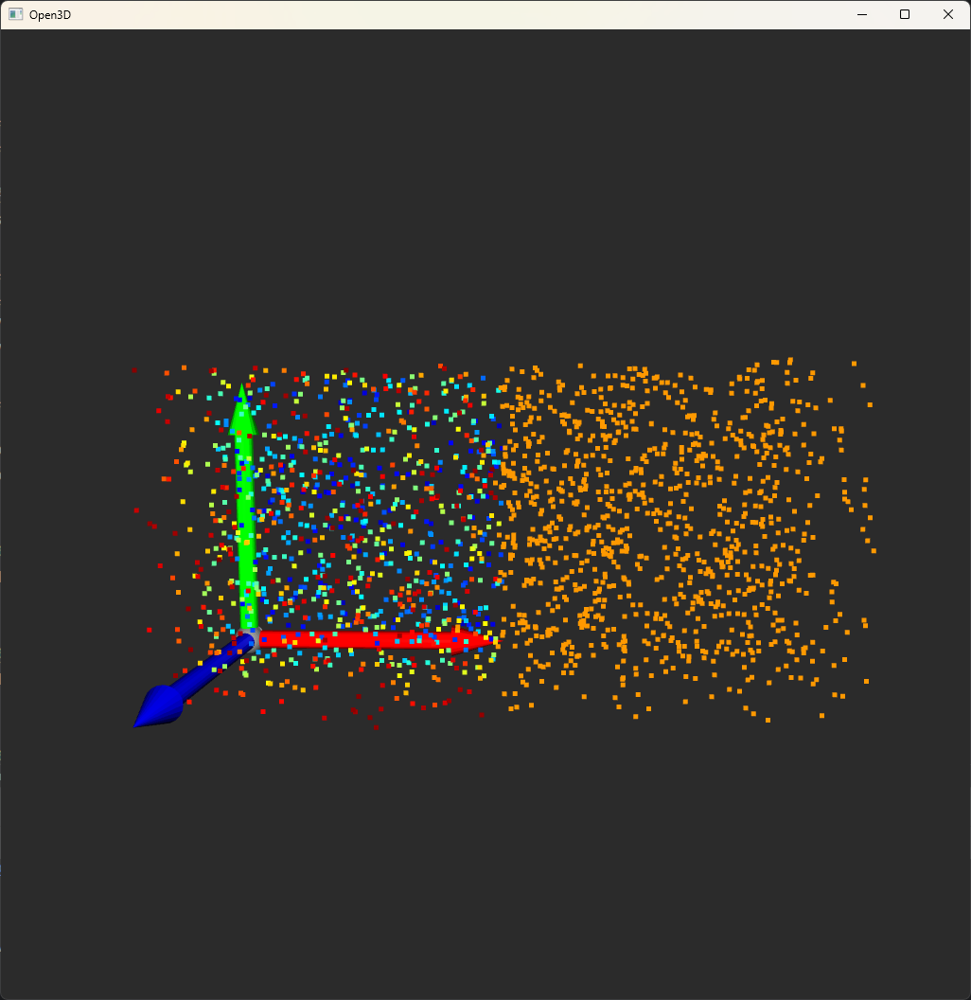
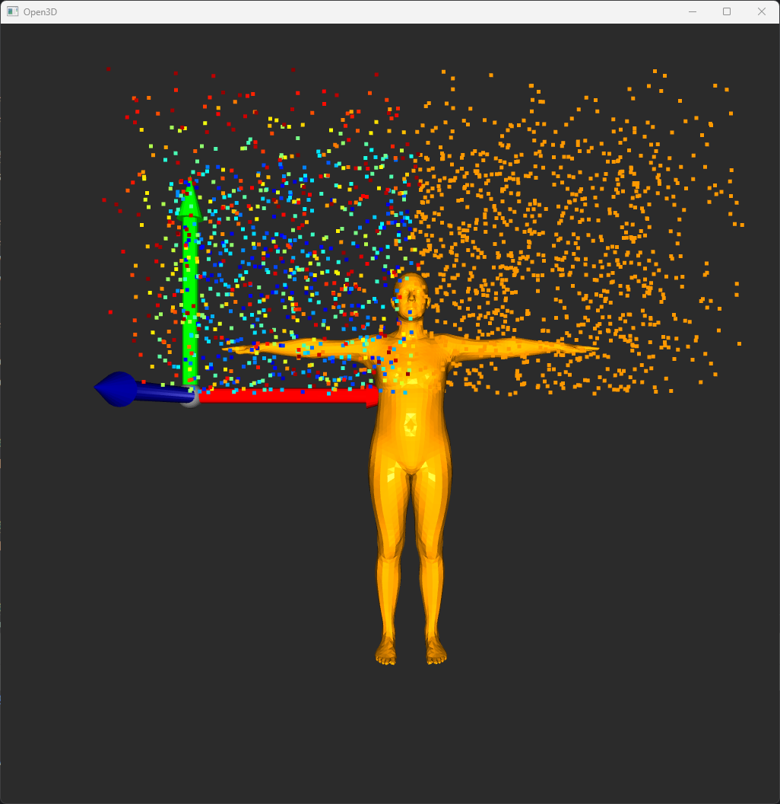

OVis 是一个基于Open3D的远程点云和人体mesh可视化程序。可以在远程服务器上运行，通过socketio与本地的Open3D可视化程序进行通信，实现远程可视化。


# 0.安装依赖
```angular2html
pip install python-socketio
pip install "python-socketio[client]"
pip install numpy
pip install open3d
pip install paramiko
```

# 0.修改config中下列字段
```angular2html
RemoteIP = '1.2.3.4'
RemoteUser = 'root'
RemotePort = 22
RemotePassword = '123456'
RemotePythonImportPath = '/~/anaconda3/envs/myenv/lib/python3.7'
```


# 1.在本地运行o3d_server.py
```angular2html
python o3d_server.py
```
运行此程序会将ovis.py复制到RemotePythonImportPath下，请确保这不会覆盖你的原有文件。
这样会打开一个o3d可视化窗口，窗口会监听本地5666端口的请求，并根据请求执行相应的可视化操作


# 2.在远程/本地运行以下命令，连接到o3d_server
```angular2html
from ovis import *
```

# 3.可视化点云
```angular2html
import numpy as np
opc(np.random.rand(1000, 3))
opc(np.random.rand(1000, 3), 0.2, (1, 1, 1), 'pc2')
```



# 4.可视化smpl人体
```angular2html
osmpl(np.zeros(72), (1, 0, 0), 0.1)
```



# 5.可视化点云视频动画
```angular2html
for i in range(10):
    opc('pc1', np.random.rand(1000, 3))
    owait(0.1)
```

# 6.重连和清空
```angular2html
oconnect()
oclear()
```